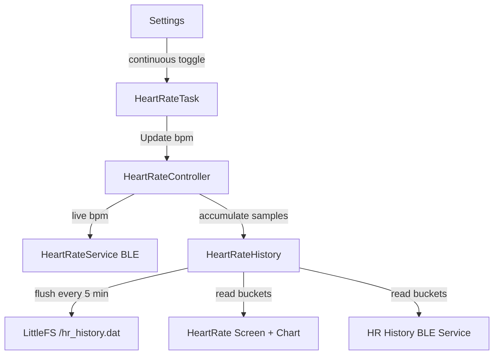

# Continuous Heart Rate Monitoring — Design

## Overview

This feature adds always-on heart rate monitoring to InfiniTime. The system continuously measures heart rate in the background, maintains a rolling current BPM, persists 5-minute interval summaries to flash (48 hours of history), and exposes history over BLE and an on-device chart.

The existing `HeartRateTask` state machine, `HeartRateController`, and settings infrastructure form the foundation. The main additions are: a persistent history store, a chart-based history viewer integrated into the HR app, and a custom BLE service for history retrieval.

## Architecture



### Key Design Decisions

1. **Reuse the existing `HeartRateTask` state machine** rather than creating a new task. The "Cont" setting option (interval = 0) already exists in the UI — we give it real meaning by making the task measure continuously when this is selected.

2. **History storage is a flat circular buffer in a single file** (`/hr_history.dat`). Each entry is a fixed-size struct. A small header tracks the write index. This avoids directory overhead and keeps writes aligned to minimize flash wear.

3. **History accumulation happens in `HeartRateController`**, which already receives every BPM update. It maintains a running accumulator (sum, count, min, max) and flushes to the history store every 5 minutes.

4. **The chart view is a second page within the existing HeartRate app**, accessible by swiping left. No new app registration needed.

## Components and Interfaces

### 1. HeartRateTask Changes

**File:** `src/heartratetask/HeartRateTask.cpp`

Current behavior when interval = 0 ("Cont"): treated the same as no interval — measurements only run in foreground. New behavior: when interval = 0, the task stays in a `ContinuousMeasuring` state that never powers down the sensor.

**State machine addition:**

```
                    ┌─────────────────────┐
                    │ ContinuousMeasuring │
                    │  (sensor always on) │
                    └──────┬──────────────┘
                           │
              WakeUp: stay │ GoToSleep: stay
              Enable: stay │ Disable: → Disabled
```

- **Entry:** When settings interval == 0 and task receives `WakeUp` or `GoToSleep`, transition to `ContinuousMeasuring` instead of `ForegroundMeasuring`/`Waiting`.
- **Behavior:** Identical to `ForegroundMeasuring` (poll sensor, run PPG) but does NOT transition to `Waiting` on `GoToSleep`.
- **Exit:** Only on `Disable` message or settings change away from continuous.
- **Task delay:** Same as measuring states (tight polling loop).

No-contact detection (ambient light spike from PPG): when detected, pause sensor for 30 seconds, then retry. This is handled by adding a `contactLostTick` timestamp. When `Ppg::Preprocess()` returns 1 (ALS exceeded), record the tick and disable the sensor. On each loop iteration, check if 30 seconds have elapsed before re-enabling.

### 2. HeartRateHistory (New Component)

**File:** `src/components/heartrate/HeartRateHistory.h/cpp`

Manages the circular buffer of 5-minute HR summaries.

```cpp
namespace Pinetime::Controllers {

  class HeartRateHistory {
  public:
    struct Entry {
      uint32_t timestamp;  // epoch seconds (start of 5-min window)
      uint8_t avgBpm;      // average BPM for the interval
      uint8_t minBpm;      // minimum BPM
      uint8_t maxBpm;      // maximum BPM
      uint8_t flags;       // bit 0: valid (1) / invalid (0)
    };                     // 8 bytes per entry

    static constexpr uint16_t maxEntries = 576;  // 48 hours
    static constexpr uint16_t bucketSeconds = 300; // 5 minutes

    HeartRateHistory(Controllers::FS& fs,
                     Controllers::DateTime& dateTime);

    // Called by HeartRateController on each new BPM value
    void Accumulate(uint8_t bpm);

    // Called periodically (e.g., every Refresh cycle) to check
    // if 5 minutes have elapsed and flush if so
    void TryFlush();

    // Read history for display/BLE
    Entry GetEntry(uint16_t index) const;  // 0 = newest
    uint16_t EntryCount() const;

    // Load/save from flash
    void Load();
    void Save();

  private:
    struct Header {
      uint32_t version;
      uint16_t writeIndex;  // next write position in ring
      uint16_t count;       // total valid entries (up to maxEntries)
    };

    // Accumulator for current bucket
    uint32_t currentBucketStart = 0;
    uint32_t bpmSum = 0;
    uint16_t bpmCount = 0;
    uint8_t bpmMin = UINT8_MAX;
    uint8_t bpmMax = 0;

    Header header;
    Controllers::FS& fs;
    Controllers::DateTime& dateTime;

    void FlushBucket();
    void WriteEntry(const Entry& entry);
    Entry ReadEntry(uint16_t ringIndex) const;
  };

}
```

**Storage layout** (`/hr_history.dat`):

```
Offset 0:    Header (8 bytes)
Offset 8:    Entry[0] (8 bytes)
Offset 16:   Entry[1] (8 bytes)
...
Offset 8 + 576*8 = 4616: Entry[575] (8 bytes)
Total: 4624 bytes (fits in 2 flash blocks of 4096 bytes)
```

**Flush logic:**
1. On each `TryFlush()` call, get current epoch seconds from `DateTime`.
2. Compute current bucket ID: `epochSeconds / 300`.
3. If `currentBucketStart` is 0 (uninitialized), set it to the current bucket ID and return.
4. If current bucket ID > `currentBucketStart`:
   - If `bpmCount > 0`: write an entry with avg/min/max and `flags = 1`.
   - If `bpmCount == 0`: write an entry with all zeros and `flags = 0` (no data).
   - Reset accumulator. Set `currentBucketStart` to current bucket ID.

**Flash write strategy:**
- Use `FileSeek` to write individual entries at their ring position (random access).
- Write the header after each entry write.
- This means 2 small writes per 5 minutes — minimal flash wear.

### 3. HeartRateController Changes

**File:** `src/components/heartrate/HeartRateController.h/cpp`

Add a reference to `HeartRateHistory`. On each `Update()` call with a valid BPM, call `history.Accumulate(bpm)`. The controller already receives every measurement result.

Add `GetHistory()` accessor so the HR screen and BLE service can read history.

Add a `lastMeasurementTime` field (epoch seconds) updated on each successful measurement, exposed via `LastMeasurementTime()` so the UI can show "measured Xs ago".

```cpp
class HeartRateController {
public:
  // ... existing interface ...
  void Update(States newState, uint8_t newHeartRate);

  HeartRateHistory& GetHistory();
  uint32_t LastMeasurementTime() const;

private:
  HeartRateHistory history;
  uint32_t lastMeasurementTime = 0;
};
```

### 4. HeartRate Screen Changes

**File:** `src/displayapp/screens/HeartRate.h/cpp`

Modify the existing HR app to:

**A. Show instant value when continuous monitoring is active:**
- In the constructor, check if continuous mode is enabled and a recent BPM exists.
- If yes, display it immediately (skip "Stopped" state, show the cached value).
- Show freshness label: "12s ago" or "now" (based on `LastMeasurementTime()`).

**B. Add a chart page accessible by swiping left:**
- On `SwipeLeft` touch event, transition to chart view.
- On `SwipeRight` in chart view, return to main HR view.
- Use `lv_chart` with `LV_CHART_TYPE_LINE`.

**Chart view layout (240x240):**

```
┌──────────────────────────┐
│  Heart Rate History      │  <- title (top 30px)
│                          │
│  ┌────────────────────┐  │
│  │     LINE CHART     │  │  <- chart area (180px tall)
│  │  BPM over time     │  │
│  │                    │  │
│  └────────────────────┘  │
│  ◄ 2h ago    now     ►   │  <- time labels (bottom 30px)
└──────────────────────────┘
```

**Chart implementation:**

```cpp
// Create chart
chart = lv_chart_create(lv_scr_act(), nullptr);
lv_obj_set_size(chart, 220, 170);
lv_obj_align(chart, nullptr, LV_ALIGN_CENTER, 0, 0);
lv_chart_set_type(chart, LV_CHART_TYPE_LINE);
lv_chart_set_point_count(chart, 24);  // 24 points = 2 hours at 5-min intervals
lv_chart_set_range(chart, 40, 200);   // BPM range

series = lv_chart_add_series(chart, LV_COLOR_RED);

// Populate from history
auto& history = heartRateController.GetHistory();
for (int i = 23; i >= 0; i--) {
  auto entry = history.GetEntry(i);
  if (entry.flags & 1) {
    lv_chart_set_next(chart, series, entry.avgBpm);
  } else {
    lv_chart_set_next(chart, series, LV_CHART_POINT_DEF);  // gap
  }
}
```

**Swipe navigation for time ranges:**
- Default view: last 2 hours (24 five-minute points).
- Swipe up/down to shift the window by 2 hours into the past/future.
- Display a time label at the bottom showing the window range (e.g., "4h ago — 2h ago").

### 5. BLE Heart Rate History Service (New)

**File:** `src/components/ble/HeartRateHistoryService.h/cpp`

Custom 128-bit UUID service for exposing historical data.

**Service UUID:** `{aabbccdd-1234-5678-abcd-ef0123456789}` (placeholder — generate a real one)

**Characteristics:**

| Characteristic | UUID suffix | Flags | Description |
|---|---|---|---|
| History Entry | `-0001` | Read | Read a single entry by index (write index first, then read) |
| Entry Count | `-0002` | Read, Notify | Number of valid entries available |
| Read Index | `-0003` | Read, Write | Set the index to read from (0 = newest) |

**Read flow (companion app):**
1. Read `Entry Count` to know how many entries exist.
2. Write desired index to `Read Index`.
3. Read `History Entry` — returns 8-byte `Entry` struct.
4. Repeat for each desired entry.

**Notify flow:**
- When a new 5-minute bucket is committed, notify `Entry Count` subscribers so they know new data is available.

**Registration:**
- Add to `NimbleController` alongside existing services.
- Pass `HeartRateController` reference for history access.

### 6. Settings Integration

**File:** `src/displayapp/screens/settings/SettingHeartRate.cpp`

The "Cont" option (interval = 0) already exists in the UI. No settings UI changes needed. The behavior change is entirely in `HeartRateTask` — when interval == 0, run continuously.

**File:** `src/components/settings/Settings.h`

No changes needed. The existing `GetHeartRateBackgroundMeasurementInterval()` returning `std::optional<uint16_t>` with value `0` already represents continuous mode.

## Data Models

### HeartRateHistory::Entry (persisted)

| Field | Type | Size | Description |
|-------|------|------|-------------|
| timestamp | uint32_t | 4 | Epoch seconds at bucket start |
| avgBpm | uint8_t | 1 | Average BPM |
| minBpm | uint8_t | 1 | Minimum BPM |
| maxBpm | uint8_t | 1 | Maximum BPM |
| flags | uint8_t | 1 | bit 0: valid data |

Total: 8 bytes per entry. 576 entries = 4,608 bytes data + 8 bytes header = 4,616 bytes.

### HeartRateHistory::Header (persisted)

| Field | Type | Size | Description |
|-------|------|------|-------------|
| version | uint32_t | 4 | Schema version for migration |
| writeIndex | uint16_t | 2 | Next write position in ring |
| count | uint16_t | 2 | Total valid entries (capped at 576) |

### In-memory accumulator (not persisted)

| Field | Type | Description |
|-------|------|-------------|
| currentBucketStart | uint32_t | Bucket ID (epochSeconds / 300) |
| bpmSum | uint32_t | Running sum of BPM values |
| bpmCount | uint16_t | Number of samples in current bucket |
| bpmMin | uint8_t | Running minimum |
| bpmMax | uint8_t | Running maximum |

## Error Handling

| Scenario | Handling |
|----------|----------|
| Flash read/write failure | Log error, continue with in-memory data. Don't crash. Retry on next flush. |
| No skin contact (ALS spike) | Pause sensor 30 seconds, retry. Mark bucket invalid if no readings in 5 minutes. |
| Clock not set (epoch = 0) | Use uptime-based bucket IDs until clock is synced via BLE. Re-anchor timestamps on first sync. |
| Corrupted history file | Version check on load. If version mismatch or read error, reset file with empty header. |
| Flash full | Circular buffer overwrites oldest. This is by design, not an error. |
| BLE read of out-of-range index | Return all-zero entry with flags = 0. |

## Testing Strategy

### Unit Tests (host-side, no hardware)

1. **HeartRateHistory accumulation logic:**
   - Accumulate N samples, verify avg/min/max math.
   - Verify flush triggers at 5-minute boundary.
   - Verify invalid bucket written when no samples accumulated.

2. **Circular buffer logic:**
   - Write 576+ entries, verify oldest overwritten.
   - Read by index (0 = newest), verify correct entry returned.
   - Verify header updated correctly after each write.

3. **Entry serialization:**
   - Write entries via mock FS, read back, verify byte layout.
   - Test version migration (wrong version → reset).

### Integration Tests (on-device or emulator)

4. **HeartRateTask continuous mode:**
   - Set interval = 0, verify sensor stays powered through sleep/wake cycles.
   - Verify no-contact detection pauses and resumes correctly.

5. **BLE History Service:**
   - Connect from test client, read entry count, write index, read entries.
   - Verify notifications fire on new bucket commit.

6. **End-to-end:**
   - Enable continuous mode, wait 10+ minutes, verify two history entries with valid data.
   - Open HR app, verify instant BPM display and chart population.

### Manual Testing Checklist

- [ ] Enable continuous mode in settings, verify HR icon/value on watch face stays updated.
- [ ] Open HR app — BPM shown immediately with "Xs ago" label.
- [ ] Swipe left in HR app — chart displays with data points.
- [ ] Remove watch — verify sensor pauses (LED off) and resumes when worn again.
- [ ] Reboot watch — verify history survives reboot and chart repopulates.
- [ ] Disable continuous mode — verify sensor powers down and old behavior resumes.
- [ ] Leave running 48+ hours — verify oldest data rolls off, no crashes or flash corruption.
- [ ] Connect companion app — verify BLE history service returns correct entries.
